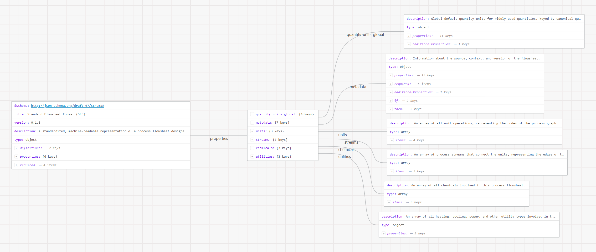

  
  

# Standard Flowsheet Format (SFF)

The **Standard Flowsheet Format (SFF)** is a JSON-based standard for representing
chemical and bioprocess flowsheets so that designs are portable across process
simulators. A flowsheet is modeled as a **directed graph**: `units` are nodes, `streams` are edges, with `chemicals` and `utilities` as shared registries
referenced by ID, plus `metadata` for provenance. A full BioSTEAM exporter is included out-of-box in this package. The format, BioSTEAM exporter, validator, and its reference corpus of flowsheets are consumed by [Project PISCES](https://projectpisces.org/).

This format captures unit operations (including design and cost results, utility demands and production, reactions, and design input specifications), streams (material flows, phases, temperature, pressure, and source and sink unit operation ports), utilities (heating, cooling, power, combustion, and others), chemicals (registry IDs and user-defined properties), and metadata for source publication, flowsheet designers, TEA parameters, and process description.

## Documentation

The [full documentation](https://pisces-standard-flowsheet-format.readthedocs.io/) includes installation instructions, tutorials for export and extending, and the full schema reference.

## Project PISCES

The SFF and associated export capabilities are used by [Project PISCES](https://projectpisces.org/) to generate a growing database of flowsheets and to train an LLM-based pipeline to extract flowsheets (as SFFs) from literature (as PDFs).

## Simplified overview of the SFF schema

<a href="https://pisces-standard-flowsheet-format.readthedocs.io/en/latest/the_format/visualize_schema.html" target="_blank" rel="noopener">
  <picture>
    <source media="(prefers-color-scheme: dark)" srcset="images/schema_viz_dark.png">
    
  </picture>
</a>

_Click the graph to open the interactive [schema visualization](https://pisces-standard-flowsheet-format.readthedocs.io/en/latest/the_format/visualize_schema.html)._
