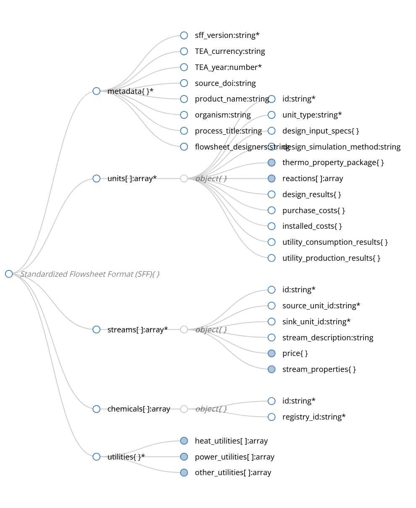

# Standardized Flowsheet Format (SFF)

Welcome to the **Standardized Flowsheet Format (SFF)** documentation. SFF is a universally interoperable file format for process designs, representing chemical processes as a directed graph.



## What is SFF?

SFF is designed to export process flowsheets for interoperability among different process simulators and tools. Currently, SFF exports from **BioSTEAM** are supported out-of-the-box, but the schema is built to be simulator-agnostic. 

With SFF, you can serialize a full chemical or biological process design—including all unit operations, streams, thermodynamics, utility data, and cost estimates—into a clear, human-readable, and machine-readable JSON structure. This ensures that front-end tools, databases, and visualization suites can easily interpret and analyze process data without needing to run complex simulations natively.

## Why use SFF?

- **Interoperability**: Read and write flowsheets across different simulation software.
- **Data Exchange**: Store process configurations, TEA (Techno-Economic Analysis) data, and LCA (Life Cycle Assessment) boundaries in a standard way.
- **Web-Friendly**: Because it's based on JSON Schema, it can be easily ingested into web frontends, databases, or parsed in Python, JavaScript, and other languages.
- **Reproducibility**: Clear definition of design specs, simulation methods, and final cost/utility results helps to reproduce TEA metrics independently.

## Getting Started

To get started using SFF in your applications, check out the [Schema Reference](schema_reference.md) to understand the structure of an SFF JSON document. 

You can also fetch the most recent schema directly via our GitHub pages deployment:

[Download Latest JSON Schema](schema.json){ .md-button .md-button--primary }

All versions of the schema are available under the `schema/` directory, for example: [`schema/schema_v_0.0.2.json`](schema/schema_v_0.0.2.json).

---

## Example Usage

An SFF document is a simple JSON file that adheres to our strict schema. An exported SFF JSON file provides all the information needed to visualize the process:

```json
{
  "metadata": { ... },
  "chemicals": [ ... ],
  "utilities": { ... },
  "units": [ ... ],
  "streams": [ ... ]
}
```

Check out our [GitHub repository](https://github.com/sustainability-software-lab/pisces-standard-flowsheet-format) for full examples from different bioindustrial models.
